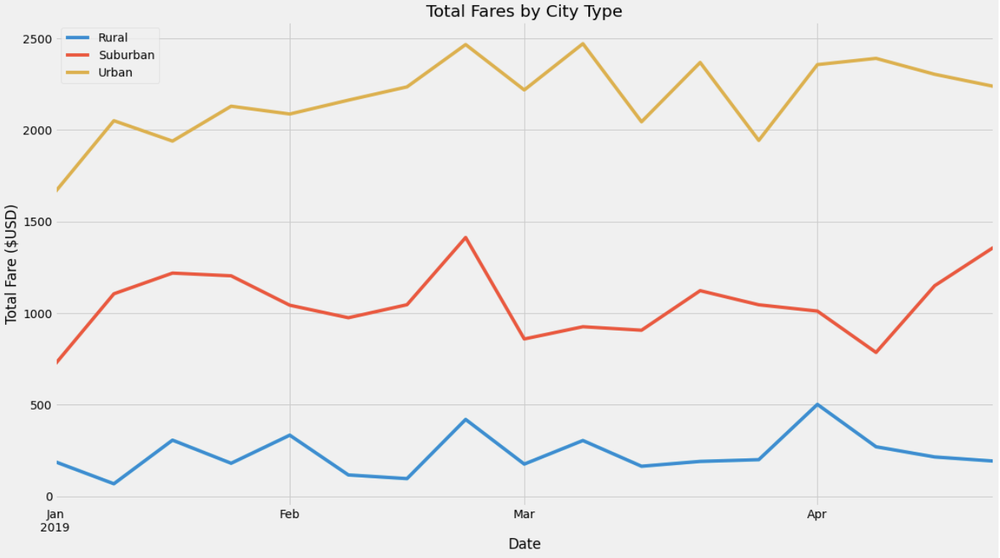

# Pyber_Analysis
The purpose of this project is to compile and review all pyber data between the dates of Jan 1st 2019 and April 29th 2019 to identify differences based on location type (urban, suburban, & rural) and make recommendations on ways to potentially increase profits for the company.

## Research

Using the data above we grouped the data by location type (Urban, Suburban, and Rural).  Once grouped we wanted to identify the total number of rides given in each area during the listed timeframe, the sum of all the fares in each area, the total number of drivers in each area during the given time and the average fare per ride and per driver.

what we saw was that it is evident that the popularity of the Pyber services increases the closer you get to metropolitan centers.  We saw a peak of 1625 trips in the urban areas, 625 trips in suburban areas (62% decrease in trips) and 125 in rural areas (**A drop of almost 94%!**). Additionally it was identifed that the number of drivers for Pyber also increased as we got closer towards city centers. As you can see below the total drivers in the rural area was a mere 78 during this timeframe while there were 2405 (**3000% more drivers!!!**).  As there are fewer drivers and less of a need in rural areas the cost per trip is vastly greater in the more rural areas.

due to the nature of being in a rural area the we can assume the distance of each trip is greater.  Longer trips equate to increased travel time per trip and a lower rider count per driver.  Lower rider count can equate to fewer tips per driver.  Additionally, those in rural areas typicaly are lower income earners and are less apt to spend as much as those in the urban areas. as such drivers may be more apt to decline to take a ride in the rural areas which may also impact the time until a potential customer receives a ride and impact service levels.

## Observations/Opportunities
1. We could utilize more demographic data and trip distance to rule out some of these potential detractors.
2.  We could suggest tips reflect a percentage of the fare when offered in app for payment.
3.  We could offer a higher percentage to drivers in the rural areas to increase driver count.
4.  We could increase ad's or promotions for our areas outside of the urban area.

